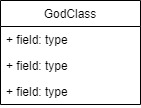

# Grupo 06 - ManaOS       
#### Diseño de sistemas 2021 - Patitas 🐶

### Diagrama de clases

### Importante
Antes de compilar y correr el server ejecutar el siguiente script en la bbdd

DELETE FROM rescatepatitas.respuesta_opcion;
DELETE FROM rescatepatitas.respuesta;
DELETE FROM rescatepatitas.opcion;
DELETE FROM rescatepatitas.pregunta;
DELETE FROM rescatepatitas.tipodepregunta;
DELETE FROM rescatepatitas.mascota_caracteristica;
DELETE FROM rescatepatitas.publicacion;
DELETE FROM rescatepatitas.mascota;
DELETE FROM rescatepatitas.usuario;
DELETE FROM rescatepatitas.organizacion;
DELETE FROM rescatepatitas.formulario;
DELETE FROM rescatepatitas.ubicacion;
DELETE FROM rescatepatitas.persona;

### Links importantes: 
* [Enunciado](https://aulasvirtuales.frba.utn.edu.ar/pluginfile.php/761206/mod_resource/content/1/TP%20DDS%202021.pdf "Patitas")
* [Decisiones de diseño](https://docs.google.com/document/d/1bG45vDb-w0RcEVAugOBXSNsjL8pkwcc_7zDoQA1kxfc/edit?usp=sharing "Docs decisiones")
* [Diagrama de clases - Draw.io](https://drive.google.com/file/d/1BcaEKOzNGF64RgP7IykojpxFEQ_TvPaJ/view "Draw.io de diagrama de clases")
* [DER - Draw.io](https://drive.google.com/file/d/1U7k8Wi2eLdUeh0utt8TjnaiGU86_4E8c/view?usp=sharing "Draw.io de DER")
* [Wireframe](https://wireframepro.mockflow.com/editor.jsp?editor=off&publicid=M5a60f34fd343a28f39d2512dc4bd765c1620241411950&projectid=M9bf525d8367cce374a29237ba13a6f291619821313399&perm=Reviewer#/page/d949a447834648e3a2ac23378601d859)
